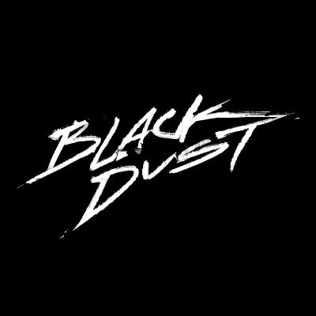

 

 

# Black Dust Project

Scavenge the wasteland, find the artifact & escape the soul-stealing Black Dust.

Links: [Twitter](https://x.com/blackdustsaga) | [Website](https://blackdustnft.com/)

Black Dust - Takrut :
[OpenSea](https://opensea.io/collection/blackdust-takrut) | [Etherscan](https://etherscan.io/address/0xfab0c2274ce0a9a8a290b4e0586030aadf0ff55c)

Black Dust :
[OpenSea](https://opensea.io/collection/blackdust) | [Etherscan](https://etherscan.io/address/0x7b6ad715d1d3389491fb735b58d518d61d6a54e8)

## Contracts

- Takrut
- Black Dust

## Features

- Upgradable Contracts
- Sale with whitelist
- On-chain refundable minting
- Manual reveal
- Non-custodial staking

### Minting Experience

### Refund Experience

### Manual Reveal Experience

### Staking Experience

